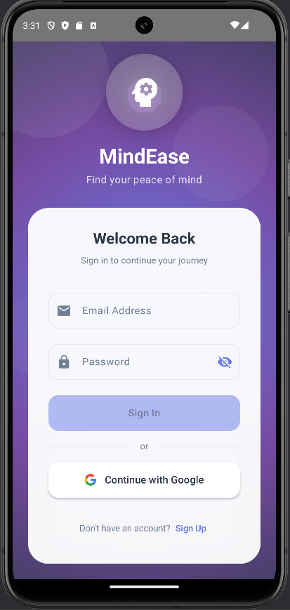

# MindEase 🎭  
**Connect with Anyone Anonymously**

MindEase is an Android application built with **Kotlin + Jetpack Compose** that allows users to connect, chat, and call others anonymously.  
It integrates **Firebase Authentication**, **Firestore**, and **WebRTC** for real-time communication, with an optional **AI-powered chat mode** using OpenAI.

---

## 📱 Features
- 🔐 **Authentication**
  - Sign up & login with Firebase
  - Google Sign-In support
- 💬 **Anonymous Chat**
  - Local database storage
  - Real-time conversations
- 📞 **Anonymous Calls**
  - WebRTC-based audio/video call system
  - Waiting & matching screens
- 🤖 **AI Chat Mode**
  - Conversational AI powered by OpenAI
- 🏠 **Home & Navigation**
  - Bottom navigation with Home, Inbox, and Profile
  - Clean UI with Jetpack Compose theme support
- 🎨 **Modern UI**
  - Material 3 theming
  - Custom colors, typography, and icons

---

## 🛠️ Tech Stack
- **Language**: Kotlin
- **UI**: Jetpack Compose, Material 3
- **Navigation**: Jetpack Navigation Component
- **Backend**: Firebase Authentication & Firestore
- **Real-time Calls**: WebRTC
- **AI Integration**: OpenAI API
- **Local Storage**: Room (LocalChatDatabase)
- **Build System**: Gradle (KTS)

---

## 📂 Project Structure
```
app/src/main/java/com/example/mindease
│── ai/              # AI chat (OpenAI integration, AIChatScreen, ViewModel)
│── auth/            # Authentication screens & ViewModel
│── call/            # Call handling (WebRTCClient, CallScreen, WaitingScreen)
│── chat/            # Local chat feature (Chat DB, LocalChatScreen)
│── data/            # Models & local DB
│── home/            # Home, Inbox, Profile screens
│── navigation/      # NavGraph & routes
│── splash/          # Splash screen
│── ui/theme/        # Colors, Typography, Theme setup
│── viewmodel/       # Shared ViewModel provider
```

---

## 🚀 Getting Started

### ✅ Prerequisites
- [Android Studio](https://developer.android.com/studio) (latest version)
- Android SDK 24+
- Gradle 8+
- Firebase project with:
  - Authentication enabled
  - Firestore database
- OpenAI API key (if using AI mode)

### 📦 Installation
1. Clone the repo:
   ```bash
   git clone https://github.com/adityakar0808/MindEase.git
   cd MindEase
   ```
2. Open the project in **Android Studio**.
3. Add your `google-services.json` file inside:
   ```
   app/src/main/
   ```
4. Create a `local.properties` file with your API key:
   ```properties
   OPENAI_API_KEY=your_api_key_here
   ```
5. Sync Gradle & run the app.

---

## 🖼️ Screenshots
*(Upload your screenshots inside a `/screenshots` folder and update the links below)*  

| Login Screen | Home Screen | Chat | Call | AI Chat |
|--------------|-------------|------|------|---------|
|  |  |  |  |  |

➡️ You have **14 screenshots** – continue adding rows until all are displayed.

---

## 🤝 Contributing
Contributions are welcome!  
1. Fork the repo  
2. Create a new branch: `feature/YourFeature`  
3. Commit your changes  
4. Push and open a PR  

---

## 📄 License
This project is licensed under the **MIT License** – see the [LICENSE](LICENSE) file for details.

---

## 👨‍💻 Author
**Aditya Kar**  
🔗 [GitHub Profile](https://github.com/adityakar0808)  

---
